# Lab 1: Deploy the AI Gateway

> Deploy Azure API Management (Basicv2) as an AI Gateway with Microsoft Foundry and monitoring infrastructure.

## 🎯 Goal

Deploy the foundational infrastructure:

- **Resource Group** for all workshop resources
- **Azure API Management** (Basicv2) — the AI Gateway with managed identity
- **Microsoft Foundry** (AI Services) with a gpt-4o-mini model deployment
- **Application Insights + Log Analytics** for monitoring
- **RBAC role assignment** — APIM's managed identity → Cognitive Services OpenAI User on Foundry

## Why Basicv2?

| SKU | Deployment time | Cost | AI Gateway support |
|-----|-----------------|------|--------------------|
| Developer | ~30 min | Low | ✅ |
| **Basicv2** | **~5-10 min** | **Low** | **✅** |
| Standardv2 | ~10 min | Medium | ✅ |
| Premium | ~45 min | High | ✅ |

We use **Basicv2** because it deploys quickly, costs very little, and supports all AI Gateway features we need.

---

## 🛤️ Choose Your Path

> Pick one path below. Each achieves the same result.

---

## 🖥️ Option: Portal

<details>
<summary><strong>Click to expand Portal instructions</strong></summary>

### 1. Create a Resource Group

1. Go to the [Azure Portal](https://portal.azure.com)
2. Search for **Resource groups** → click **+ Create**

   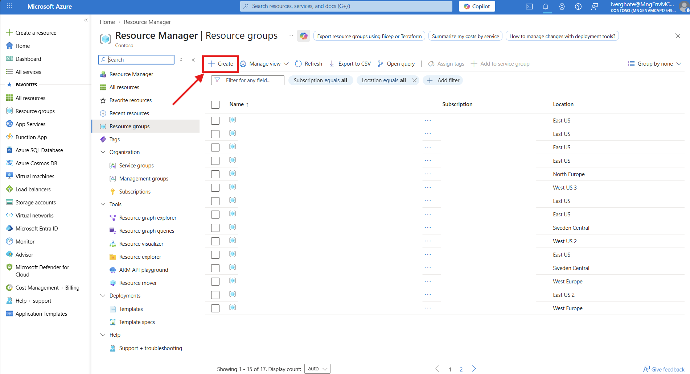

3. Fill in:
   - **Subscription**: Your subscription
   - **Resource group**: `rg-aigateway-workshop`
   - **Region**: `Sweden Central`

   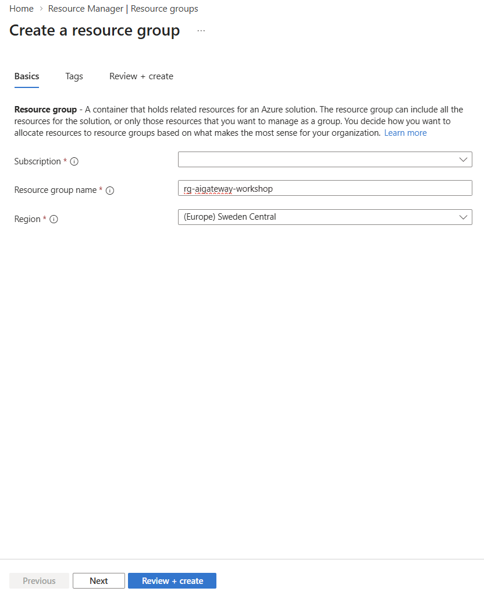

4. Click **Review + create** → **Create**

### 2. Create Application Insights

1. Search for **Application Insights** → click **+ Create**

   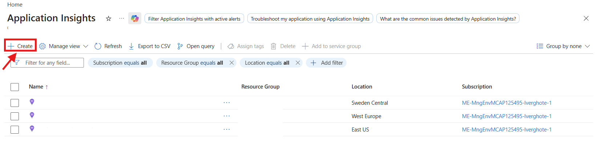

2. Under **Project details**, fill in:
   - **Subscription**: Your subscription
   - **Resource group**: `rg-aigateway-workshop`
3. Under **Instance details**, fill in:
   - **Name**: `appi-aigateway` (or add a unique suffix)
   - **Region**: `Sweden Central`
3. Under **Log Analytics Workspace**, fill in:
   - **Subscription**: Your subscription
   - **Log Analytics Workspace**: Leave default (should show (new) `DefaultWorkspace-...`)

   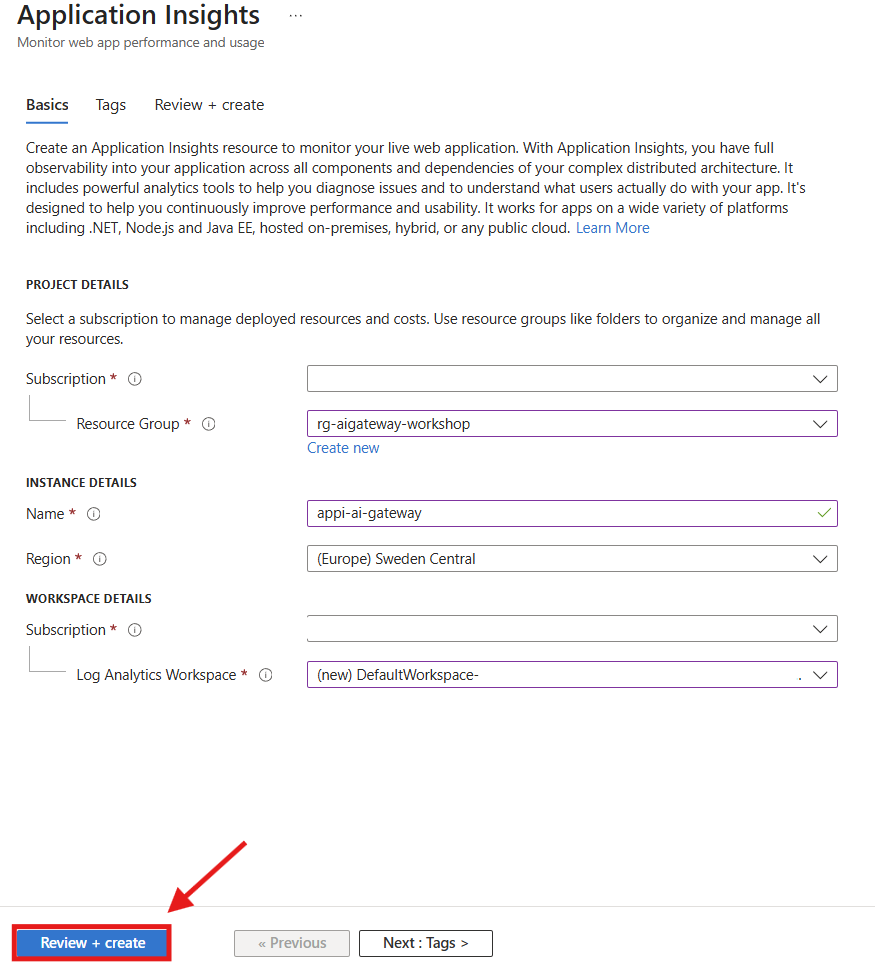

4. Click **Review + create** → **Create**

### 3. Create API Management (Basicv2)

1. Search for **API Management services** → click **+ Create**

   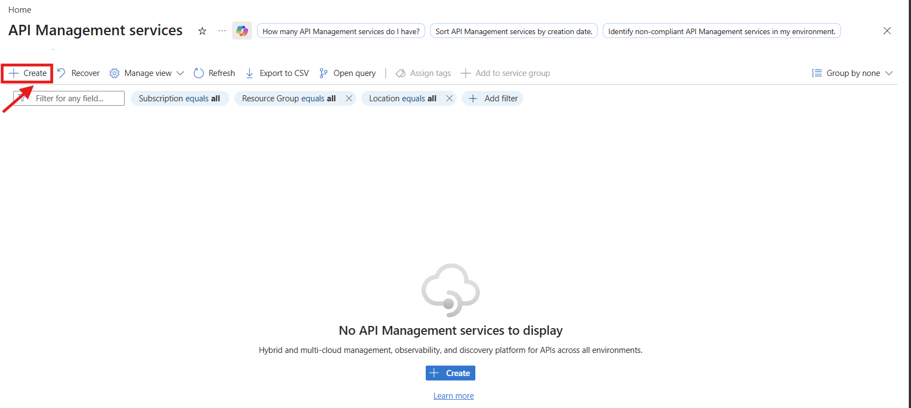

2. **Basics** tab:
   - **Resource group**: `rg-aigateway-workshop`
   - **Region**: `Sweden Central`
   - **Resource name**: `apim-aigateway-<unique-suffix>` (must be globally unique)
   - **Organization name**: `AI Gateway Workshop`
   - **Administrator email**: Your email
   - **Pricing tier**: **Basicv2**

   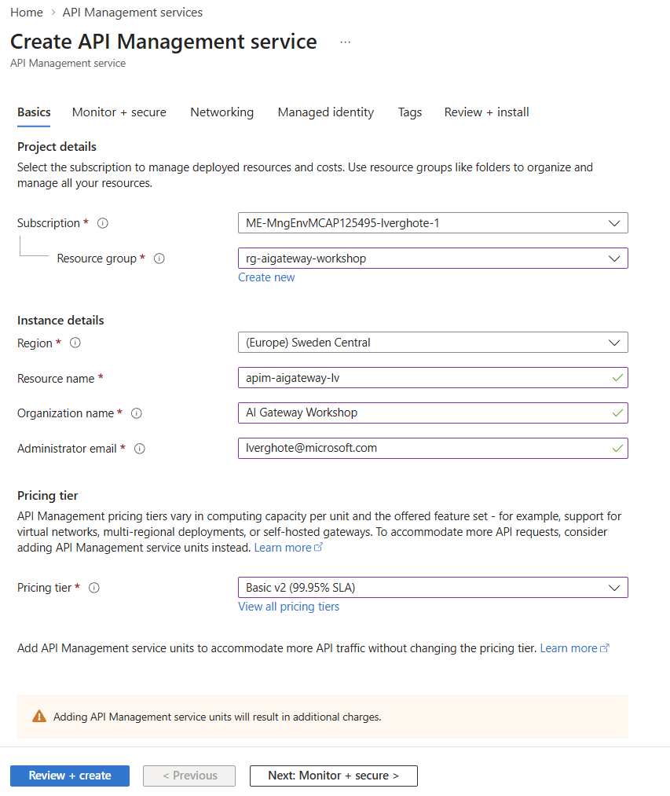

3. **Monitor + secure** tab: 
   - Toggle **Application Insights** to **On**
   - Select the `appi-aigateway` Application Insights instance

   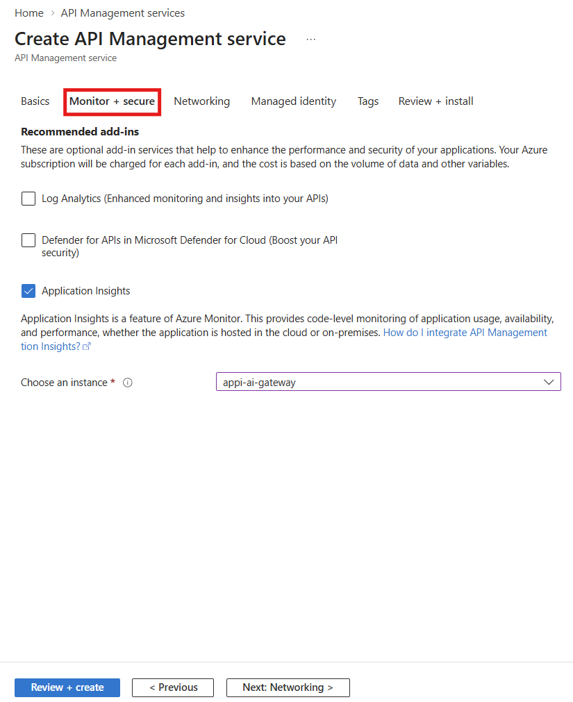

4. **Managed identity** tab: Toggle **System assigned** to **On**
5. Click **Review + create** → **Create**

   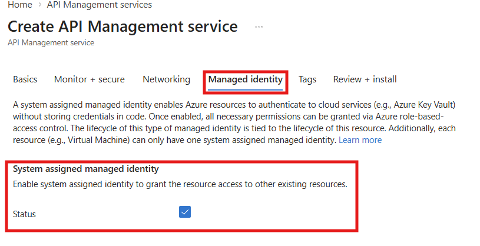

> ⏱️ Deployment takes ~5-10 minutes.

### 4. Create Microsoft Foundry Resource

1. Search for **Microsoft Foundry** → click **+ Create**

   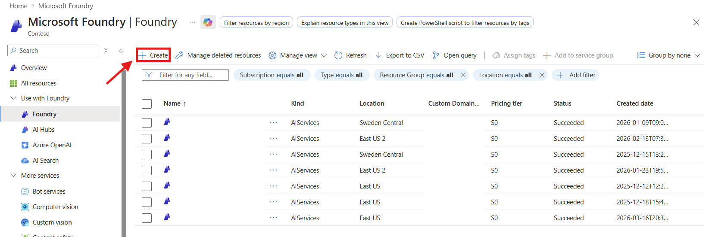

2. Fill in:
   - **Subscription**: Your subscription
   - **Resource group**: `rg-aigateway-workshop`
   - **Name**: `ais-aigateway-<unique-suffix>` (globally unique)
   - **Region**: `Sweden Central`
   - **Default project name**: `ais-aigateway-<unique-suffix>`

   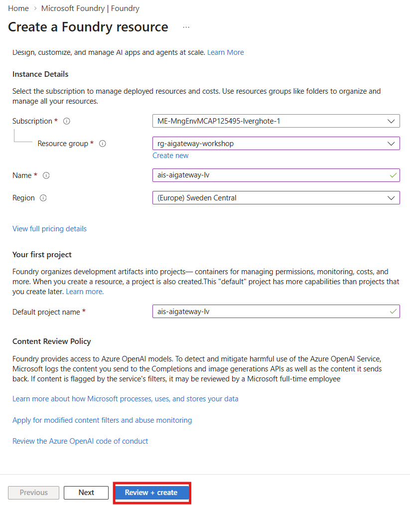

3. Click **Review + create** → **Create**

#### Deploy the gpt-4o-mini model

1. Wait for the deployment to finish and the press **Go to resource** and then **Go to Foundry portal**

   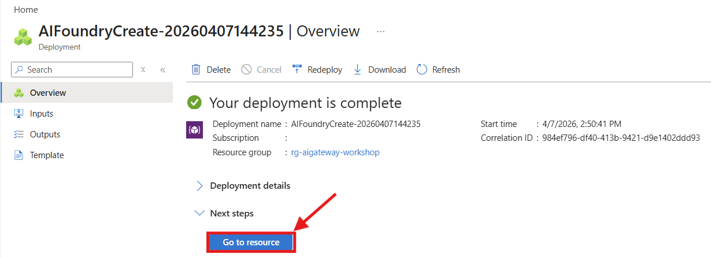
   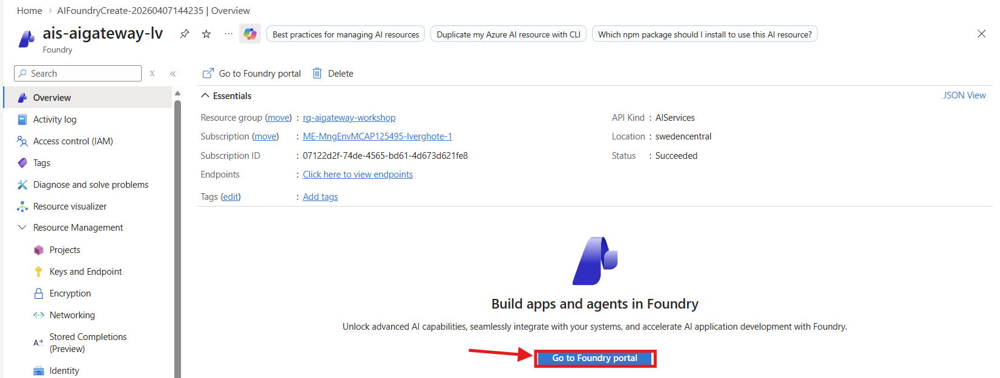

2. Go to the **Discover** tab on top → **Models** on the left
3. Search for **gpt-4o-mini** in the search bar → select **gpt-4o-mini**

   

4. Click **Deploy** → **Default settings**

   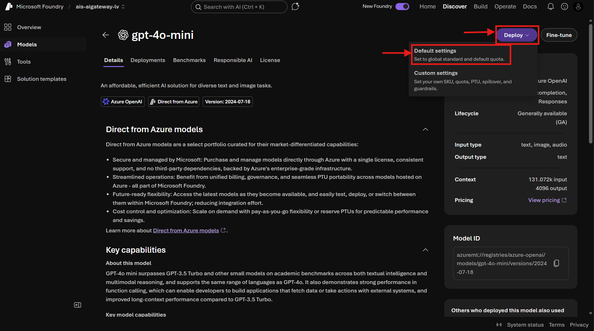

### 5. Set up RBAC

1. Navigate to your **Microsft Foundry** resource in the azure portal
2. Go to **Access control (IAM)** 

   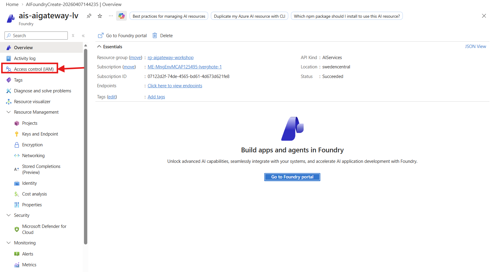

3. Click **+ Add** → **Add role assignment**

   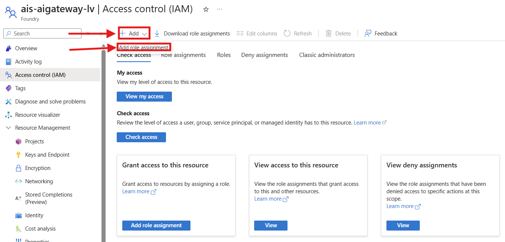

3. Search and select **Cognitive Services OpenAI User** → **Next**
4. **Assign access to**: `Managed identity` → **+ Select members**
5. Filter by `API Management service` → select your APIM instance → **Select**
6. Click **Review + assign** → **Review + assign**

   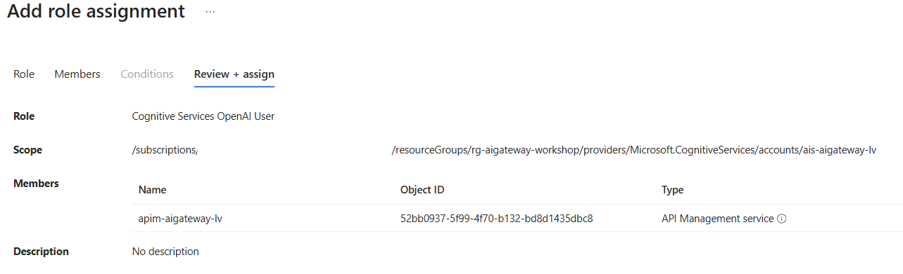

### ✅ Portal Checkpoint

- [ ] Resource group `rg-aigateway-workshop`
- [ ] API Management (Basicv2) with managed identity enabled
- [ ] Microsoft Foundry with gpt-4o-mini deployed
- [ ] Application Insights + Log Analytics workspace
- [ ] RBAC: APIM → Cognitive Services OpenAI User on Foundry

</details>

---

## 💻 Option: CLI

<details>
<summary><strong>Click to expand CLI instructions</strong></summary>

### 1. Set up your environment

```powershell
# From the repository root
python -m venv .venv
.venv\Scripts\Activate.ps1
pip install -r requirements.txt
az login
```

### 2. Create a Resource Group

```powershell
$RESOURCE_GROUP = "rg-aigateway-workshop"
$LOCATION = "swedencentral"

az group create --name $RESOURCE_GROUP --location $LOCATION
```

### 3. Deploy the infrastructure

```powershell
cd infra

az deployment group create `
  --resource-group $RESOURCE_GROUP `
  --template-file main.bicep `
  --parameters location=$LOCATION `
  --parameters apimPublisherEmail="your-email@domain.com" `
  --parameters apimPublisherName="Workshop Participant"
```

> ⏱️ Deployment takes ~5-10 minutes for Basicv2.

### 4. Verify the deployment

```powershell
$APIM_NAME = az apim list -g $RESOURCE_GROUP --query "[0].name" -o tsv
$GATEWAY_URL = az apim show --name $APIM_NAME -g $RESOURCE_GROUP --query "gatewayUrl" -o tsv

Write-Host "APIM Name:   $APIM_NAME"
Write-Host "Gateway URL: $GATEWAY_URL"
```

### ✅ CLI Checkpoint

You should see output similar to:

```
APIM Name:   apim-aigateway-abc123
Gateway URL: https://apim-aigateway-abc123.azure-api.net
```

</details>

---

## 🔧 Option: Bicep

<details>
<summary><strong>Click to expand Bicep instructions</strong></summary>

### 1. Set up and login

```powershell
python -m venv .venv
.venv\Scripts\Activate.ps1
pip install -r requirements.txt
az login
```

### 2. Create a Resource Group

```powershell
$RESOURCE_GROUP = "rg-aigateway-workshop"
$LOCATION = "swedencentral"

az group create --name $RESOURCE_GROUP --location $LOCATION
```

### 3. Deploy with the parameter file

The repository includes `infra/main.bicepparam` with sensible defaults. Deploy in one command:

```powershell
cd infra

az deployment group create `
  --resource-group $RESOURCE_GROUP `
  --template-file main.bicep `
  --parameters main.bicepparam
```

> ⏱️ Deployment takes ~5-10 minutes for Basicv2.

### Understanding the Bicep modules

```
infra/
├── main.bicep              ← Orchestrator: conditional flags control what gets deployed
├── main.bicepparam         ← Default parameters (Lab 1 baseline)
├── all-features.bicepparam ← Full deployment with all features (see README)
└── modules/
    ├── apim.bicep           ← API Management (Basicv2) + App Insights logger
    ├── foundry.bicep        ← Microsoft Foundry + gpt-4o-mini model
    ├── app-insights.bicep   ← Application Insights + Log Analytics
    ├── role-assignment.bicep ← RBAC role assignments
    └── apim-api.bicep       ← Backend, API import, policy, subscription
```

Key parameters in `main.bicep`:

| Parameter | Default | Purpose |
|-----------|---------|---------|
| `enableApiConfig` | `false` | Deploy backend + API + policy (Lab 2+) |
| `enableContentSafety` | `false` | Content Safety backend + RBAC (Lab 4) |
| `enableSecondaryFoundry` | `false` | Second Foundry + backend pool (Lab 5) |
| `policyXml` | `base-policy.xml` | Policy XML to apply |

### 4. Verify

```powershell
$APIM_NAME = az apim list -g $RESOURCE_GROUP --query "[0].name" -o tsv
$GATEWAY_URL = az apim show --name $APIM_NAME -g $RESOURCE_GROUP --query "gatewayUrl" -o tsv

Write-Host "APIM Name:   $APIM_NAME"
Write-Host "Gateway URL: $GATEWAY_URL"
```

### ✅ Bicep Checkpoint

You should see a valid APIM name and gateway URL.

</details>

---

## Verify in the Portal

Regardless of which path you chose, navigate to your resource group in the [Azure Portal](https://portal.azure.com). You should see:

| Resource | Type |
|----------|------|
| `apim-aigateway-*` | API Management service |
| `appi-aigateway-*` | Application Insights |
| `law-appi-aigateway-*` | Log Analytics workspace |
| `ais-aigateway-*` | AI Services (Microsoft Foundry) |

## Architecture

```
┌──────────────────────────────────────────────────────────────┐
│  rg-aigateway-workshop                                       │
│                                                              │
│  ┌───────────────────────┐       ┌────────────────────────┐  │
│  │  API Management       │       │  Microsoft Foundry     │  │
│  │  (Basicv2)            │       │  (AI Services)         │  │
│  │  - Managed Identity ──┼─RBAC─►│  - gpt-4o-mini         │  │
│  │  - Gateway URL        │       │                        │  │
│  └───────────────────────┘       └────────────────────────┘  │
│                                                              │
│  ┌───────────────────────┐       ┌────────────────────────┐  │
│  │  Application Insights │──────►│  Log Analytics         │  │
│  │  (Monitoring)         │       │  workspace             │  │
│  └───────────────────────┘       └────────────────────────┘  │
└──────────────────────────────────────────────────────────────┘
```

---

**Next:** [Lab 2 — Add Microsoft Foundry Backend →](lab-02-add-openai-backend.md)
