# Lab 2: Add Microsoft Foundry Backend

> Connect Microsoft Foundry as a backend to your API Management gateway with managed identity authentication.

## 🎯 Goal

Configure APIM to proxy requests to Microsoft Foundry:

- Create a **backend** in APIM pointing to your Foundry endpoint
- Import the **Azure OpenAI REST API specification**
- Apply a **policy** that authenticates using APIM's managed identity
- Create a **subscription** for API key-based access control
- **Test** the end-to-end flow

## Why Managed Identity?

Instead of storing API keys in APIM, we use the managed identity assigned in Lab 1. APIM authenticates to Foundry automatically — no secrets to rotate or leak.

```
Client → (subscription key) → APIM → (managed identity token) → Microsoft Foundry
```

---

## 🛤️ Choose Your Path

---

## 🖥️ Option: Portal

<details>
<summary><strong>Click to expand Portal instructions</strong></summary>

### 1. Create the Backend

1. Go to **API Management** in the [Azure Portal](https://portal.azure.com) and clikc on the resource we just created

   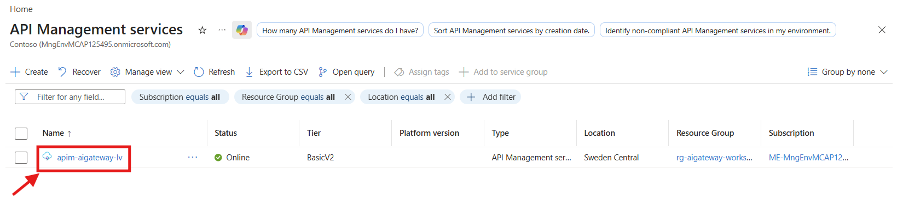

2. Navigate to **APIs → Backends** → **+ Create new backend**

   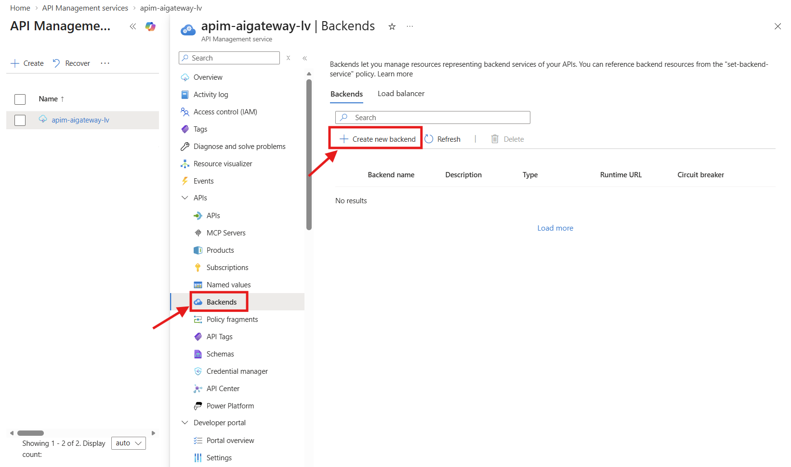

3. Fill in:
   - **Name**: `foundry-backend`
   - **Backend hosting type**: `Custom URL`
   - **Runtime URL**: `https://<your-foundry-name>.cognitiveservices.azure.com/openai`

      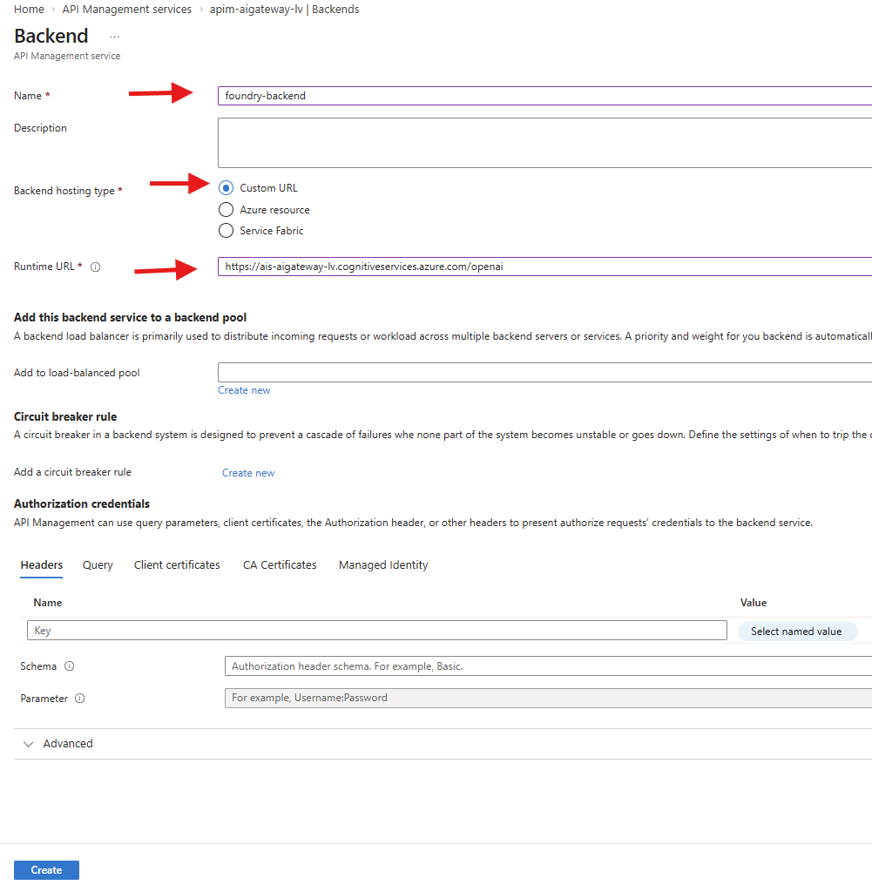

4. Click **Create**

### 2. Import the Azure OpenAI API

1. Go to **APIs → APIs** → **+ Add API**
2. Select **Microsoft Foundry**

   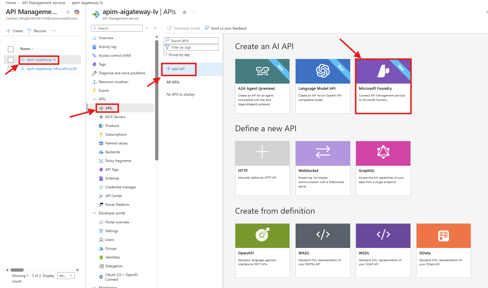

3. Select your created AI Service (`ais-aigateway-<uniqueID>`)
4. Select **Review** → **Create**

   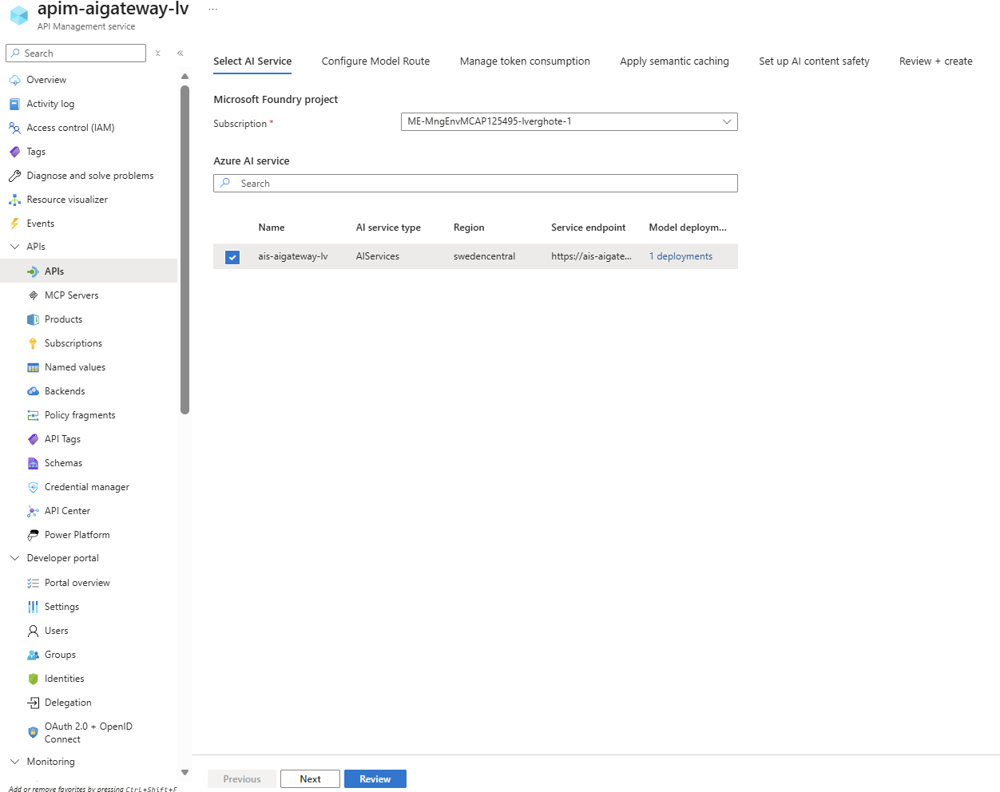

### 3. Apply the Managed Identity Policy

1. Select your newly imported **Microsoft Foundry API**
2. Click **All operations** in the left panel
3. Click the **</>** icon in the **Inbound processing** section to open the policy editor

   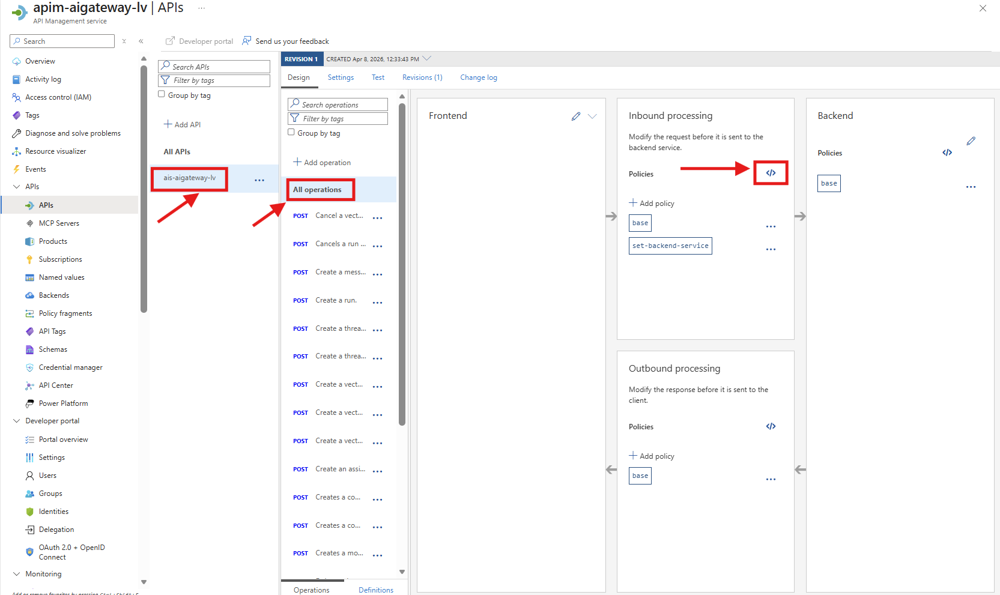

4. Replace the entire policy with the content of `policies/managed-identity-auth.xml`:

```xml
<policies>
    <inbound>
        <base />
        <authentication-managed-identity 
            resource="https://cognitiveservices.azure.com" 
            output-token-variable-name="managed-id-access-token" 
            ignore-error="false" />
        <set-header name="Authorization" exists-action="override">
            <value>@("Bearer " + (string)context.Variables["managed-id-access-token"])</value>
        </set-header>
        <set-backend-service backend-id="foundry-backend" />
    </inbound>
    <backend>
        <base />
    </backend>
    <outbound>
        <base />
    </outbound>
    <on-error>
        <base />
    </on-error>
</policies>
```

5. Click **Save**

   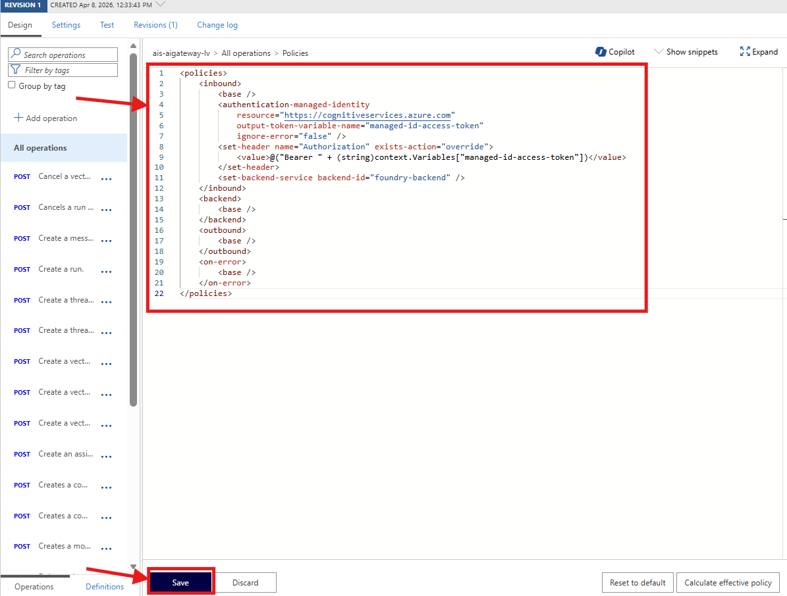

### 4. Create a Test Subscription

APIM uses **subscriptions** to control access to APIs. A subscription provides a pair of keys (primary and secondary) that clients must include in the `Ocp-Apim-Subscription-Key` header when calling the API. Without a valid subscription key, APIM rejects the request with a 401 Unauthorized.

This is how you give consumers (developers, apps, teams) access to your gateway — each gets their own subscription with its own keys, so you can track usage and revoke access per consumer.

1. Go to **APIs → Subscriptions** → **+ Add subscription**

   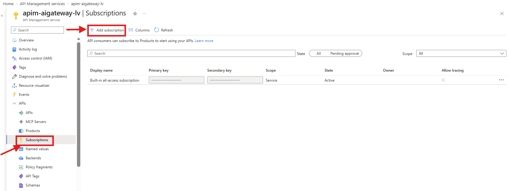

2. Fill in:
   - **Name**: `test-sub`
   - **Display name**: `Test Subscription`
   - **Scope**: `API` 
   - **API**: select the Microsoft Foundry API you created.
3. Click **Create**
4. Click on the subscription → ... → Show/hide keys → copy the **Primary key**

   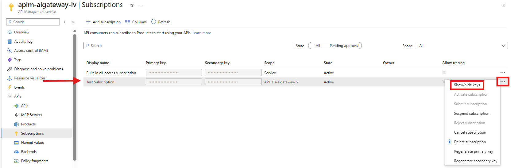

### 5. Test the API

Now let's verify the full flow works end-to-end: your request goes through APIM, which authenticates to Foundry using its managed identity, and forwards the call to the OpenAI model.

APIM has a built-in **Test** console that lets you send requests directly from the portal — it automatically includes the subscription key, so you don't need an external tool like Postman or curl.

1. Go to **APIs** on the left pannel → select **Microsoft Foundry API**
2. Click the **Test** tab
3. Select the **Creates a completion for the chat message** operation

   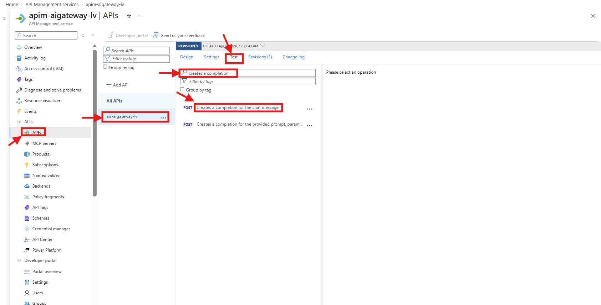

4. Set:
   - **deployment-id**: `gpt-4o-mini`
   - **api-version**: `2024-10-21`
5. In the request body:
   ```json
   {
     "messages": [{"role": "user", "content": "Say hello"}],
     "max_tokens": 50
   }
   ```

   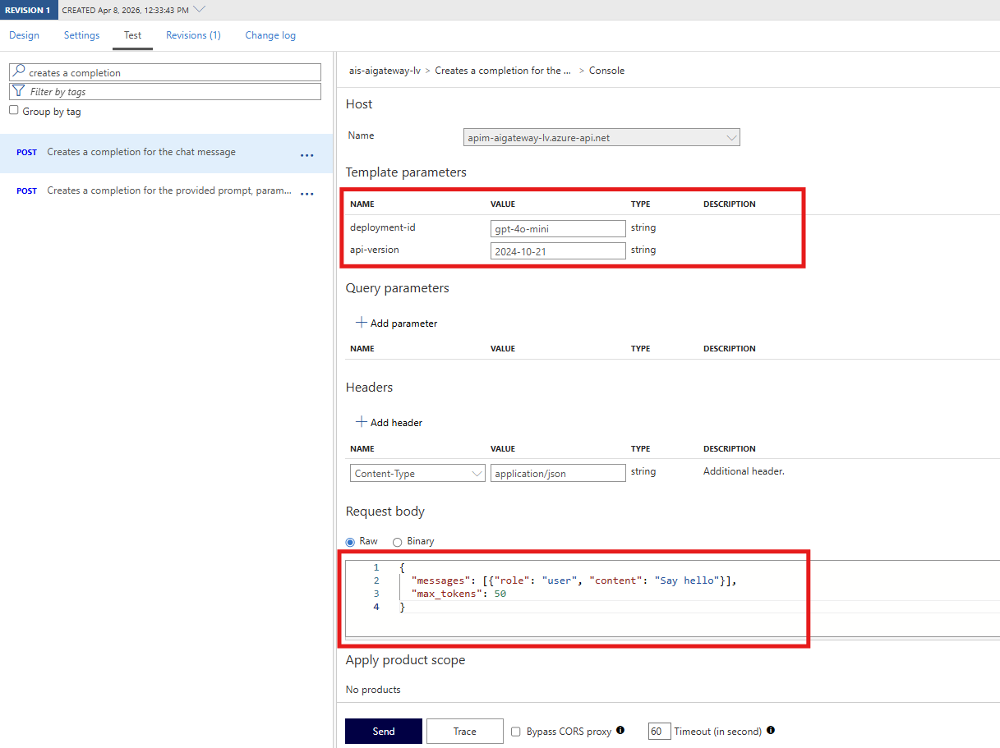

6. Click **Send**

If you scroll down, you should see a 200 response with a chat completion.

   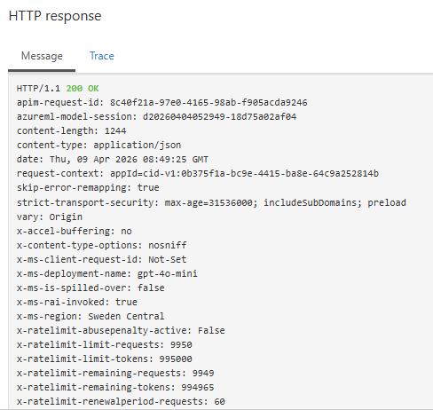
      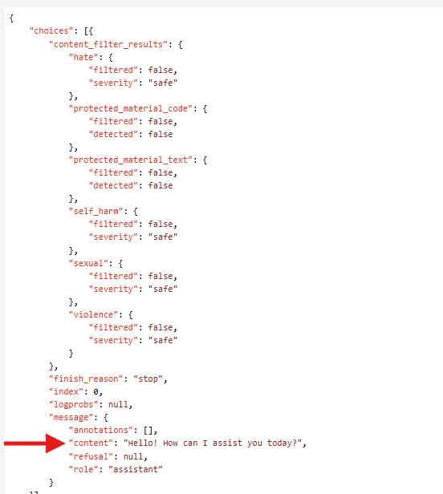

### ✅ Portal Checkpoint

- [ ] Backend `foundry-backend` created
- [ ] Azure OpenAI API imported
- [ ] Managed identity policy applied
- [ ] Test subscription created
- [ ] Test call returns a 200 response

</details>

---

## 💻 Option: CLI

<details>
<summary><strong>Click to expand CLI instructions</strong></summary>

### 1. Set variables

> If you're continuing from Lab 1, your `$RESOURCE_GROUP` and `$LOCATION` are already set.

```powershell
$RESOURCE_GROUP = "rg-aigateway-workshop"
$LOCATION = "swedencentral"
```

### 2. Deploy with API configuration enabled

```powershell
cd infra

$policyXml = Get-Content -Path "../policies/managed-identity-auth.xml" -Raw

@{
  '`$schema' = 'https://schema.management.azure.com/schemas/2019-04-01/deploymentParameters.json#'
  contentVersion = '1.0.0.0'
  parameters = @{
    location        = @{ value = $LOCATION }
    enableApiConfig = @{ value = $true }
    policyXml       = @{ value = $policyXml }
  }
} | ConvertTo-Json -Depth 5 | Set-Content -Path "temp-params.json" -Encoding utf8

az deployment group create `
  --resource-group $RESOURCE_GROUP `
  --template-file main.bicep `
  --parameters temp-params.json
```

This deploys:
- **Backend** (`openai-backend`) pointing to your Foundry endpoint
- **API** imported from the Azure OpenAI spec
- **Policy** with managed identity authentication
- **Subscription** (`test-sub`) for API access
- **API diagnostic** connecting to Application Insights

### 3. Test the gateway

```powershell
$APIM_NAME = az apim list -g $RESOURCE_GROUP --query "[0].name" -o tsv
$SUBSCRIPTION_ID = az account show --query "id" -o tsv
$GATEWAY_URL = az apim show --name $APIM_NAME -g $RESOURCE_GROUP --query "gatewayUrl" -o tsv

$SUB_KEY = (az rest --method post `
  --url "https://management.azure.com/subscriptions/$SUBSCRIPTION_ID/resourceGroups/$RESOURCE_GROUP/providers/Microsoft.ApiManagement/service/$APIM_NAME/subscriptions/test-sub/listSecrets?api-version=2024-05-01" `
  | ConvertFrom-Json).primaryKey

$body = @{
    messages = @(@{ role = "user"; content = "What is Azure API Management in one sentence?" })
    model = "gpt-4o-mini"
    max_tokens = 50
} | ConvertTo-Json -Depth 5

$headers = @{
    "Ocp-Apim-Subscription-Key" = $SUB_KEY
    "Content-Type" = "application/json"
}

Invoke-RestMethod `
  -Uri "$GATEWAY_URL/openai/deployments/gpt-4o-mini/chat/completions?api-version=2024-10-21" `
  -Method POST -Headers $headers -Body $body | ConvertTo-Json -Depth 5
```

### ✅ CLI Checkpoint

You should see a JSON response with `choices[0].message.content` containing an answer.

</details>

---

## 🔧 Option: Bicep

<details>
<summary><strong>Click to expand Bicep instructions</strong></summary>

### 1. Set variables

```powershell
$RESOURCE_GROUP = "rg-aigateway-workshop"
$LOCATION = "swedencentral"
```

### 2. Deploy with API configuration

This deployment enables `enableApiConfig` and applies the managed identity policy:

```powershell
cd infra

az deployment group create `
  --resource-group $RESOURCE_GROUP `
  --template-file main.bicep `
  --parameters location=$LOCATION `
  --parameters enableApiConfig=true `
  --parameters policyXml="$(Get-Content -Path '../policies/managed-identity-auth.xml' -Raw)"
```

### What gets deployed

The `enableApiConfig=true` flag triggers the `apim-api.bicep` module, which creates:

| Resource | Purpose |
|----------|---------|
| `openai-backend` | Backend pointing to Foundry endpoint |
| `azure-openai-api` | API imported from OpenAI spec |
| `policy` | Managed identity auth policy |
| `test-sub` | Subscription scoped to the API |
| `applicationinsights` diagnostic | API-level logging |

The policy (`policies/managed-identity-auth.xml`) does three things in the inbound section:
1. **`authentication-managed-identity`** — acquires a token for `cognitiveservices.azure.com`
2. **`set-header`** — injects `Authorization: Bearer <token>`
3. **`set-backend-service`** — routes to `openai-backend`

### 3. Test the gateway

```powershell
$APIM_NAME = az apim list -g $RESOURCE_GROUP --query "[0].name" -o tsv
$SUBSCRIPTION_ID = az account show --query "id" -o tsv
$GATEWAY_URL = az apim show --name $APIM_NAME -g $RESOURCE_GROUP --query "gatewayUrl" -o tsv

$SUB_KEY = (az rest --method post `
  --url "https://management.azure.com/subscriptions/$SUBSCRIPTION_ID/resourceGroups/$RESOURCE_GROUP/providers/Microsoft.ApiManagement/service/$APIM_NAME/subscriptions/test-sub/listSecrets?api-version=2024-05-01" `
  | ConvertFrom-Json).primaryKey

$body = @{
    messages = @(@{ role = "user"; content = "What is Azure API Management in one sentence?" })
    model = "gpt-4o-mini"
    max_tokens = 50
} | ConvertTo-Json -Depth 5

Invoke-RestMethod `
  -Uri "$GATEWAY_URL/openai/deployments/gpt-4o-mini/chat/completions?api-version=2024-10-21" `
  -Method POST -Headers @{
    "Ocp-Apim-Subscription-Key" = $SUB_KEY
    "Content-Type" = "application/json"
  } -Body $body | ConvertTo-Json -Depth 5
```

### ✅ Bicep Checkpoint

You should see a JSON response with a chat completion from gpt-4o-mini.

</details>

---

## Expected Result

A successful request through the gateway looks like this:

```json
{
  "id": "chatcmpl-...",
  "choices": [
    {
      "message": {
        "role": "assistant",
        "content": "Azure API Management is a fully managed service..."
      }
    }
  ],
  "usage": {
    "prompt_tokens": 15,
    "completion_tokens": 30,
    "total_tokens": 45
  }
}
```

The `usage` section shows token consumption — we'll use this for rate limiting in the next lab.

---

**Next:** [Lab 3 — Token Rate Limiting →](lab-03-token-rate-limiting.md)
