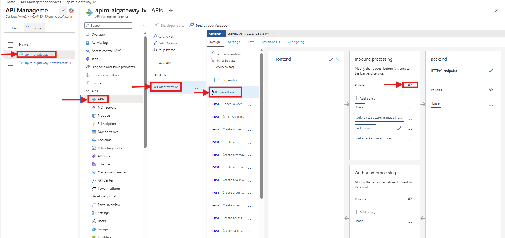
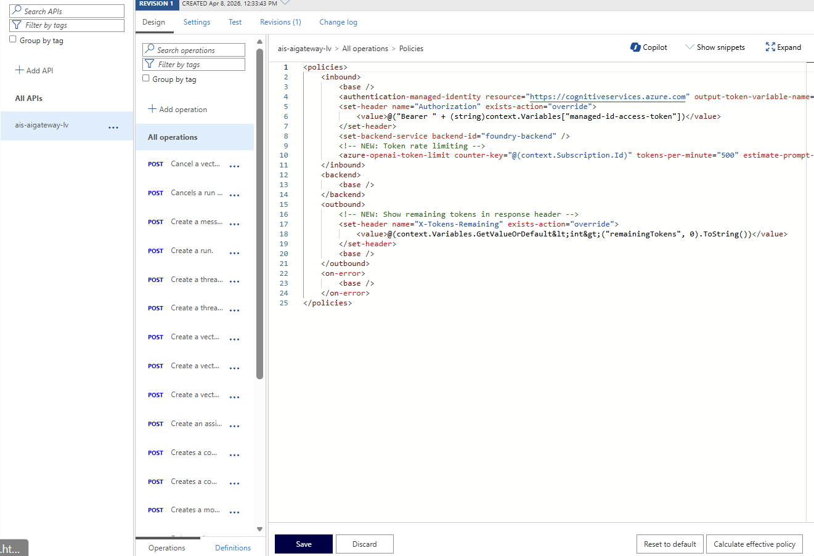
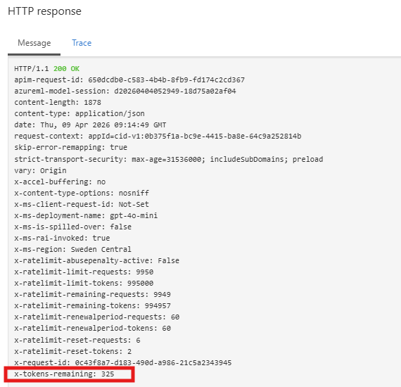
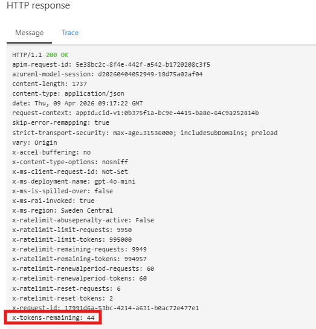
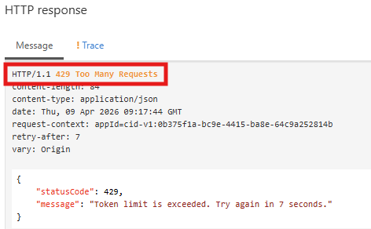
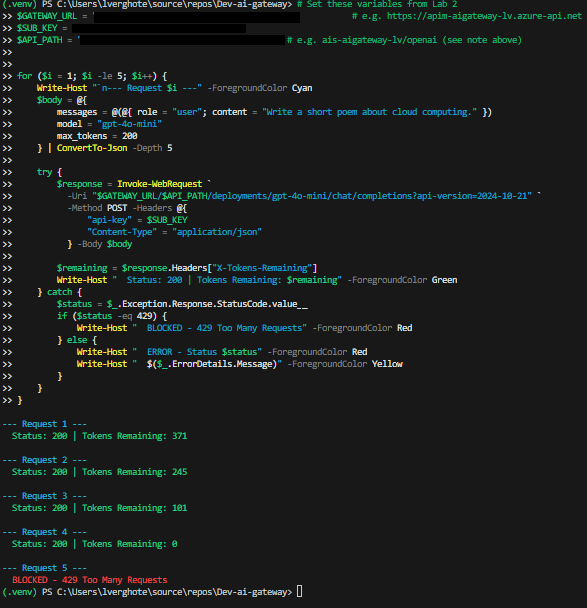

# Lab 3: Token Rate Limiting

> Control token consumption per subscriber with the `azure-openai-token-limit` policy.

## 🎯 Goal

Add token rate limiting to the gateway so that:

- Each subscription is limited to **500 tokens per minute**
- The response includes an `X-Tokens-Remaining` header showing the remaining budget
- Requests that exceed the limit get **HTTP 429 (Too Many Requests)** and the model is never called

## Why Token Rate Limiting?

AI model calls are expensive. Each request consumes tokens (both for the prompt you send and the response you receive). Without limits, a single consumer could exhaust your entire model quota or run up costs.

Token rate limiting lets you:
- **Protect shared capacity**: ensure one noisy consumer doesn't starve others
- **Control costs**: set a predictable ceiling on token consumption per subscriber
- **Fail fast**: reject requests *before* they reach Foundry, so you don't pay for calls that shouldn't happen

This is different from traditional request-per-second throttling as it operates on **tokens** (the actual unit of AI cost), not HTTP requests.

## How It Works

The `azure-openai-token-limit` policy counts tokens per subscription. When the limit is hit, APIM returns 429 immediately without forwarding the request to Foundry — saving both cost and quota.

```
Client                          APIM                           Foundry
  │──── Request ──────────────►│                               │
  │                            │─── Check token budget ──►     │
  │                            │   (tokens remaining? yes)     │
  │                            │──── Forward request ─────────►│
  │◄──── Response (200) ───────│◄──── Response ────────────────│
  │  X-Tokens-Remaining: 350   │                               │
  │                            │                               │
  │──── Request ──────────────►│                               │
  │                            │─── Check token budget ──►     │
  │                            │   (tokens remaining? no)      │
  │◄──── 429 Too Many Req ─────│        (not called)           │
```

---

## 🛤️ Choose Your Path

---

## 🖥️ Option: Portal

<details>
<summary><strong>Click to expand Portal instructions</strong></summary>

### 1. Edit the API Policy

In Lab 2 you applied a policy for managed identity authentication. Now you'll extend that policy to also count tokens. The new policy keeps everything from Lab 2 and adds two things: an inbound rule that tracks token consumption, and an outbound rule that reports remaining tokens back to the caller.

1. Go to your **API Management** resource in the [Azure Portal](https://portal.azure.com)
2. Navigate to **APIs → APIs** → select **Microsoft Foundry API**
3. Click **All operations** → click the **</>** icon in **Inbound processing**

   

4. Replace the entire policy with the content of `policies/token-rate-limit.xml`:

```xml
<policies>
    <inbound>
        <base />
        <authentication-managed-identity 
            resource="https://cognitiveservices.azure.com" 
            output-token-variable-name="managed-id-access-token" 
            ignore-error="false" />
        <set-header name="Authorization" exists-action="override">
            <value>@("Bearer " + (string)context.Variables["managed-id-access-token"])</value>
        </set-header>
        <set-backend-service backend-id="foundry-backend" />
        
        <!-- NEW: Token rate limiting -->
        <azure-openai-token-limit 
            counter-key="@(context.Subscription.Id)"
            tokens-per-minute="500" 
            estimate-prompt-tokens="false" 
            remaining-tokens-variable-name="remainingTokens" />
    </inbound>
    <backend>
        <base />
    </backend>
    <outbound>
        <!-- NEW: Show remaining tokens in response header -->
        <set-header name="X-Tokens-Remaining" exists-action="override">
            <value>@(context.Variables.GetValueOrDefault&lt;int&gt;("remainingTokens", 0).ToString())</value>
        </set-header>
        <base />
    </outbound>
    <on-error>
        <base />
    </on-error>
</policies>
```

5. Click **Save**

   

### 2. Test token rate limiting

Now verify the rate limit is working. Send multiple requests — the first few should succeed (with a decreasing `X-Tokens-Remaining` header), and once the 500-token budget is exhausted, APIM will reject further requests with HTTP 429.

#### Option A: Use the Test tab in the portal

This is the same approach as Lab 2 — the portal's built-in Test console lets you send requests directly without any external tooling.

1. Go to **APIs → APIs** → select your **Microsoft Foundry API**
2. Click the **Test** tab
3. Select the **Creates a completion for the chat message** operation
4. Fill in the template parameters:
   - **deployment-id:** `gpt-4o-mini`
   - **api-version:** `2024-10-21`
5. Set the **Request body** to:

```json
{
    "messages": [{"role": "user", "content": "Write a short poem about cloud computing."}],
    "max_tokens": 200
}
```

6. Click **Send**
7. In the **HTTP response**, check the response headers — you should see `X-Tokens-Remaining` with the remaining token budget

   

8. **Send the same request 3–4 more times** — watch `X-Tokens-Remaining` decrease each time
9. Once the budget is exhausted, you'll get an **HTTP 429** response instead of 200

   > **Tip:** The Test console automatically includes your subscription key, so you don't need to add it manually.

    
    

#### Option B: Use PowerShell

If you prefer to test from the command line, open a terminal and run the following script. It sends 5 requests in a loop so you can see the rate limit kick in.

> **Finding your API path and subscription key header:** When you imported the API via the Microsoft Foundry tile, two things are different from the CLI/Bicep path:
> 1. **API path** — the API is registered at a path based on your Foundry resource name (e.g., `ais-aigateway-lv/openai`), not just `openai`. To find it: go to **APIs → APIs** → select your Microsoft Foundry API → **Settings** tab → look at the **Base URL**.
> 2. **Subscription key header** — the Foundry import uses `api-key` as the header name (not the default `Ocp-Apim-Subscription-Key`). You can verify this in **Settings** → **Subscription key header name**.

```powershell
# Set these variables from Lab 2
$GATEWAY_URL = "<your-gateway-url>"           # e.g. https://apim-aigateway-lv.azure-api.net
$SUB_KEY = "<your-subscription-key>"
$API_PATH = "<your-api-path>"                 # e.g. ais-aigateway-lv/openai (see note above)

for ($i = 1; $i -le 5; $i++) {
    Write-Host "`n--- Request $i ---" -ForegroundColor Cyan
    $body = @{
        messages = @(@{ role = "user"; content = "Write a short poem about cloud computing." })
        model = "gpt-4o-mini"
        max_tokens = 200
    } | ConvertTo-Json -Depth 5

    try {
        $response = Invoke-WebRequest `
          -Uri "$GATEWAY_URL/$API_PATH/deployments/gpt-4o-mini/chat/completions?api-version=2024-10-21" `
          -Method POST -Headers @{
              "api-key" = $SUB_KEY
              "Content-Type" = "application/json"
          } -Body $body

        $remaining = $response.Headers["X-Tokens-Remaining"]
        Write-Host "  Status: 200 | Tokens Remaining: $remaining" -ForegroundColor Green
    } catch {
        $status = $_.Exception.Response.StatusCode.value__
        if ($status -eq 429) {
            Write-Host "  BLOCKED - 429 Too Many Requests" -ForegroundColor Red
        } else {
            Write-Host "  ERROR - Status $status" -ForegroundColor Red
            Write-Host "  $($_.ErrorDetails.Message)" -ForegroundColor Yellow
        }
    }
}
```

You should see the first requests succeed with decreasing token budgets, then get blocked once the 500-token limit is exhausted:




### ✅ Portal Checkpoint

- [ ] Policy updated with `azure-openai-token-limit`
- [ ] First requests succeed with `X-Tokens-Remaining` header decreasing
- [ ] After ~500 tokens consumed, requests return HTTP 429
- [ ] Waiting 1 minute resets the counter and requests succeed again

</details>

---

## 💻 Option: CLI

<details>
<summary><strong>Click to expand CLI instructions</strong></summary>

### 1. Deploy the token rate limit policy

This reads the `token-rate-limit.xml` policy file and passes it to the Bicep deployment as a parameter. The template applies it as the API-level inbound policy.

```powershell
$RESOURCE_GROUP = "rg-aigateway-workshop"
$LOCATION = "swedencentral"

cd infra

$policyXml = Get-Content -Path "../policies/token-rate-limit.xml" -Raw

@{
  '`$schema' = 'https://schema.management.azure.com/schemas/2019-04-01/deploymentParameters.json#'
  contentVersion = '1.0.0.0'
  parameters = @{
    location        = @{ value = $LOCATION }
    enableApiConfig = @{ value = $true }
    policyXml       = @{ value = $policyXml }
  }
} | ConvertTo-Json -Depth 5 | Set-Content -Path "temp-params.json" -Encoding utf8

az deployment group create `
  --resource-group $RESOURCE_GROUP `
  --template-file main.bicep `
  --parameters temp-params.json
```

### 2. Test token rate limiting

Send 5 requests in a loop. With a 500-token-per-minute budget and `max_tokens=200`, you should see the first 2–3 requests succeed before hitting the limit.

```powershell
$APIM_NAME = az apim list -g $RESOURCE_GROUP --query "[0].name" -o tsv
$SUBSCRIPTION_ID = az account show --query "id" -o tsv
$GATEWAY_URL = az apim show --name $APIM_NAME -g $RESOURCE_GROUP --query "gatewayUrl" -o tsv

$SUB_KEY = (az rest --method post `
  --url "https://management.azure.com/subscriptions/$SUBSCRIPTION_ID/resourceGroups/$RESOURCE_GROUP/providers/Microsoft.ApiManagement/service/$APIM_NAME/subscriptions/test-sub/listSecrets?api-version=2024-05-01" `
  | ConvertFrom-Json).primaryKey

$headers = @{
    "Ocp-Apim-Subscription-Key" = $SUB_KEY
    "Content-Type" = "application/json"
}

for ($i = 1; $i -le 5; $i++) {
    Write-Host "`n--- Request $i ---" -ForegroundColor Cyan
    $body = @{
        messages = @(@{ role = "user"; content = "Write a short poem about cloud computing." })
        model = "gpt-4o-mini"
        max_tokens = 200
    } | ConvertTo-Json -Depth 5

    try {
        $response = Invoke-WebRequest `
          -Uri "$GATEWAY_URL/openai/deployments/gpt-4o-mini/chat/completions?api-version=2024-10-21" `
          -Method POST -Headers $headers -Body $body

        $remaining = $response.Headers["X-Tokens-Remaining"]
        Write-Host "  Status: 200 | Tokens Remaining: $remaining" -ForegroundColor Green
    } catch {
        $status = $_.Exception.Response.StatusCode.value__
        if ($status -eq 429) {
            Write-Host "  BLOCKED - 429 Too Many Requests" -ForegroundColor Red
        } else {
            Write-Host "  ERROR - Status $status" -ForegroundColor Red
            Write-Host "  $($_.ErrorDetails.Message)" -ForegroundColor Yellow
        }
    }
}
```

### ✅ CLI Checkpoint

- First 2–3 requests succeed (with decreasing `X-Tokens-Remaining`)
- Subsequent requests return **HTTP 429**
- Token counter resets after 1 minute

</details>

---

## 🔧 Option: Bicep

<details>
<summary><strong>Click to expand Bicep instructions</strong></summary>

### 1. Deploy with the token rate limit policy

This command reads the token-rate-limit policy XML and passes it inline to the Bicep deployment. The `enableApiConfig=true` flag tells the template to create the API, backend, subscription, and apply this policy.

```powershell
$RESOURCE_GROUP = "rg-aigateway-workshop"
$LOCATION = "swedencentral"

cd infra

az deployment group create `
  --resource-group $RESOURCE_GROUP `
  --template-file main.bicep `
  --parameters location=$LOCATION `
  --parameters enableApiConfig=true `
  --parameters policyXml="$(Get-Content -Path '../policies/token-rate-limit.xml' -Raw)"
```

### What changed in the policy

The policy builds on Lab 2's `managed-identity-auth.xml`. Everything from Lab 2 (managed identity auth, set Authorization header, set backend) is still there. Two new elements are added:

**Inbound** — token counting (added after `set-backend-service`):
```xml
<azure-openai-token-limit 
    counter-key="@(context.Subscription.Id)"
    tokens-per-minute="500" 
    estimate-prompt-tokens="false" 
    remaining-tokens-variable-name="remainingTokens" />
```
- `counter-key` — uses the subscription ID so each consumer gets their own token budget
- `tokens-per-minute` — the ceiling (500 is intentionally low for testing; production values would be much higher)
- `estimate-prompt-tokens` — when `false`, APIM counts actual tokens from the Foundry response; when `true`, it estimates prompt tokens upfront to reject earlier
- `remaining-tokens-variable-name` — stores the remaining count in a context variable so we can expose it

**Outbound** — expose remaining tokens in a response header:
```xml
<set-header name="X-Tokens-Remaining" exists-action="override">
    <value>@(context.Variables.GetValueOrDefault&lt;int&gt;("remainingTokens", 0).ToString())</value>
</set-header>
```

### 2. Test

```powershell
$APIM_NAME = az apim list -g $RESOURCE_GROUP --query "[0].name" -o tsv
$SUBSCRIPTION_ID = az account show --query "id" -o tsv
$GATEWAY_URL = az apim show --name $APIM_NAME -g $RESOURCE_GROUP --query "gatewayUrl" -o tsv

$SUB_KEY = (az rest --method post `
  --url "https://management.azure.com/subscriptions/$SUBSCRIPTION_ID/resourceGroups/$RESOURCE_GROUP/providers/Microsoft.ApiManagement/service/$APIM_NAME/subscriptions/test-sub/listSecrets?api-version=2024-05-01" `
  | ConvertFrom-Json).primaryKey

for ($i = 1; $i -le 5; $i++) {
    Write-Host "`n--- Request $i ---" -ForegroundColor Cyan
    $body = @{
        messages = @(@{ role = "user"; content = "Write a short poem about cloud computing." })
        model = "gpt-4o-mini"
        max_tokens = 200
    } | ConvertTo-Json -Depth 5

    try {
        $response = Invoke-WebRequest `
          -Uri "$GATEWAY_URL/openai/deployments/gpt-4o-mini/chat/completions?api-version=2024-10-21" `
          -Method POST -Headers @{
              "Ocp-Apim-Subscription-Key" = $SUB_KEY
              "Content-Type" = "application/json"
          } -Body $body

        $remaining = $response.Headers["X-Tokens-Remaining"]
        Write-Host "  Status: 200 | Tokens Remaining: $remaining" -ForegroundColor Green
    } catch {
        $status = $_.Exception.Response.StatusCode.value__
        if ($status -eq 429) {
            Write-Host "  BLOCKED - 429 Too Many Requests" -ForegroundColor Red
        } else {
            Write-Host "  ERROR - Status $status" -ForegroundColor Red
            Write-Host "  $($_.ErrorDetails.Message)" -ForegroundColor Yellow
        }
    }
}
```

### ✅ Bicep Checkpoint

First requests succeed, then get blocked with 429 after exceeding 500 tokens per minute.

</details>

---

## Expected Result

```
--- Request 1 ---
  Status: 200 | Tokens Remaining: 380
--- Request 2 ---
  Status: 200 | Tokens Remaining: 150
--- Request 3 ---
  BLOCKED - 429 Too Many Requests
```

The exact numbers depend on token usage (prompt + completion tokens). After 1 minute, the counter resets and requests will succeed again.

> **Tip:** If you want to see the reset in action, wait 60 seconds after hitting 429 and send another request — it should succeed with the full budget restored.

---

**Next:** [Lab 4 — Content Safety →](lab-04-content-safety.md)
