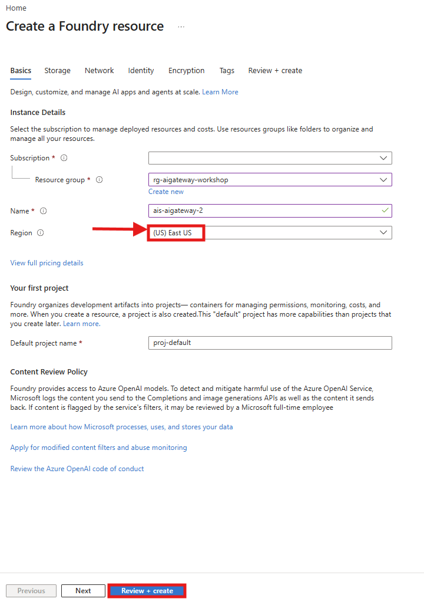
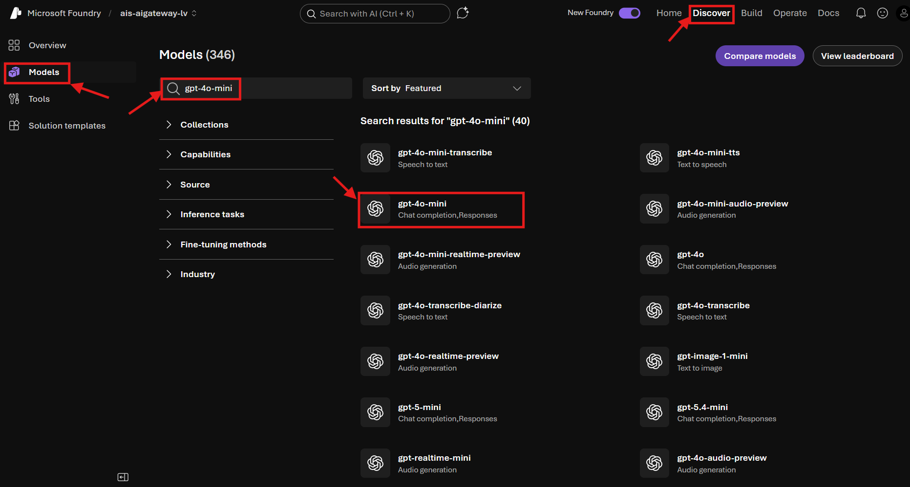
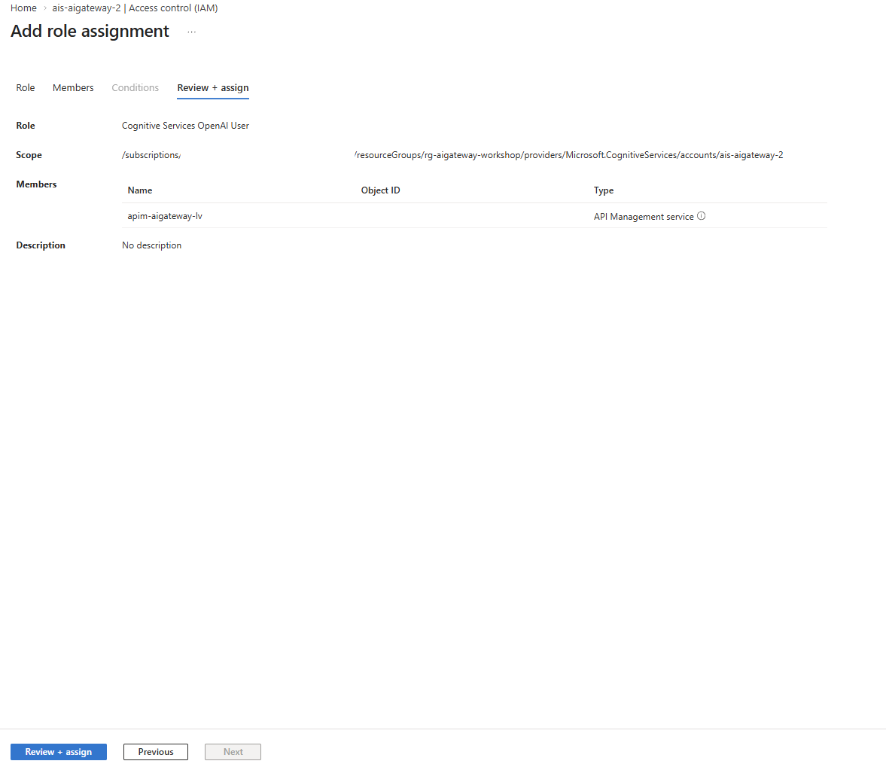

# Lab 5: Load Balancing

> Distribute requests across multiple Microsoft Foundry instances for resilience and throughput.

## 🎯 Goal

Add load balancing to the gateway:

- Deploy a **second Microsoft Foundry** instance in a different region (East US)
- Create a **backend pool** with weighted routing (60/40 split)
- Add **retry logic** for 429 (rate limit) and 503 (service unavailable) errors
- APIM automatically fails over when one backend is unavailable

## How It Works

APIM's backend pool distributes requests across multiple Foundry instances. If one returns 429 or 503, the retry policy tries another backend in the pool. This is all transparent to the client.

```
                                                              ┌──────────────────────┐
                                                         ┌───►│ Foundry (Primary)    │
                                                         │    │ Sweden Central       │
                              ┌──────────────────────┐   │    │  - gpt-4.1-mini      │
                              │  openai-pool         │   │    └──────────────────────┘
                              │  (Backend Pool)      │   │
                              ├──────────────────────┤   │
Client ──► APIM ─────────────►│  openai-backend      │───┘
              │               │  weight: 60, pri: 1  │
              │               ├──────────────────────┤
              │  retry on  ──►│  openai-backend-2nd  │───┐
              └─ 429 / 503    │  weight: 40, pri: 1  │   │
                              └──────────────────────┘   │    ┌──────────────────────┐
                                                         │    │ Foundry (Secondary)  │
                                                         └───►│ East US              │
                                                              │  - gpt-4.1-mini      │
                                                              └──────────────────────┘
```

## Prerequisites

- **Lab 2** completed (API + backend configured)

---

## 🛤️ Choose Your Path

---

## 🖥️ Option: Portal

<details>
<summary><strong>Click to expand Portal instructions</strong></summary>

### 1. Create a Second Microsoft Foundry Resource

We need a second Foundry instance in a different region so APIM can distribute traffic and fail over when one region is unavailable or rate-limited.

1. Search for **Azure AI Services** → **+ Create** → **Azure AI Services**
2. Fill in:
   - **Resource group**: `rg-aigateway-workshop`
   - **Region**: **East US** (different from primary!)
   - **Name**: `ais-aigateway-2` (globally unique)

   

3. Click **Review + create** → **Create**

#### Deploy gpt-4o-mini on the secondary

1. Wait for the deployment to finish, then press **Go to resource** → **Go to Foundry portal**
2. Go to the **Discover** tab on top → **Models** on the left
3. Search for **gpt-4o-mini** in the search bar → select **gpt-4o-mini**

   

4. Click **Deploy** → **Default settings**
5. Select the right region and leave project on default. 

### 2. Add RBAC for the Secondary

Just like in Lab 1, APIM's managed identity needs the **Cognitive Services OpenAI User** role on this new Foundry resource — otherwise it won't be able to authenticate when requests are routed to the secondary.

1. Navigate to your **secondary Microsoft Foundry** resource in the Azure portal (leaving the Foundry portal tab)
2. Go to **Access control (IAM)**
3. Click **+ Add** → **Add role assignment**
4. Search and select **Cognitive Services OpenAI User** → **Next**
5. **Assign access to**: `Managed identity` → **+ Select members**
6. Filter by `API Management service` → select your APIM instance → **Select**
7. Click **Review + assign** → **Review + assign**

   

### 3. Create the Secondary Backend

A backend in APIM is a pointer to a downstream service URL. In Lab 2 you created `foundry-backend` for your primary Foundry. Now we add a second one for the East US instance.

1. Go to your **API Management** resource → **APIs → Backends** → **+ Create new backend**
2. Fill in:
   - **Name**: `foundry-backend-secondary`
   - **Backend hosting type**: `Custom URL`
   - **Runtime URL**: `https://<secondary-foundry>.cognitiveservices.azure.com/openai` (e.g. `https://ais-aigateway-2.cognitiveservices.azure.com/openai`)
3. Click **Create**

### 4. Create the Backend Pool

A **backend pool** is the key to load balancing. Instead of routing to a single backend, APIM routes to the pool, which distributes requests across its members using **priority** and **weight**:

- **Priority** controls failover order — backends with the same priority receive traffic simultaneously. If all priority-1 backends fail, APIM falls back to priority-2.
- **Weight** controls the traffic split within the same priority level — a 60/40 split means roughly 60% of requests go to the primary and 40% to the secondary.

1. In **Backends** → **+ Create new backend**
2. Fill in:
   - **Name**: `foundry-pool`
   - **Backend hosting type**: `Pool`
3. Add backends to the pool:
   - `foundry-backend` — Priority: `1`, Weight: `60`
   - `foundry-backend-secondary` — Priority: `1`, Weight: `40`
4. Click **Create**

### 5. Update the API Policy

Now we update the policy to point to the pool instead of the single backend, and add retry logic so that if one Foundry instance returns 429 (rate limited) or 503 (unavailable), APIM automatically retries on another backend in the pool.

1. Go to **APIs → APIs** → select your **Microsoft Foundry API**
2. Click **All operations** in the left panel
3. Click the **</>** icon in the **Inbound processing** section to open the policy editor
4. Replace the entire policy with:

> **Important:** The `backend-id` values must match what you created above. If you followed the Portal path, the pool is called `foundry-pool`. The CLI/Bicep paths use `openai-pool`.

```xml
<policies>
    <inbound>
        <base />
        <authentication-managed-identity 
            resource="https://cognitiveservices.azure.com" 
            output-token-variable-name="managed-id-access-token" 
            ignore-error="false" />
        <set-header name="Authorization" exists-action="override">
            <value>@("Bearer " + (string)context.Variables["managed-id-access-token"])</value>
        </set-header>
        <!-- Route to the backend pool instead of a single backend -->
        <set-backend-service backend-id="foundry-pool" />
    </inbound>
    <backend>
        <!-- Retry on 429 or 503 — tries another backend in the pool -->
        <retry count="2" interval="0" first-fast-retry="true" 
            condition="@(context.Response.StatusCode == 429 || context.Response.StatusCode == 503)">
            <set-backend-service backend-id="foundry-pool" />
            <forward-request buffer-request-body="true" />
        </retry>
    </backend>
    <outbound>
        <base />
    </outbound>
    <on-error>
        <base />
    </on-error>
</policies>
```

5. Click **Save**

### 6. Test load balancing

Send multiple requests — you should see responses from both regions.

#### Option A: Use the Test tab in the portal

1. Go to **APIs → APIs** → select your **Microsoft Foundry API**
2. Click the **Test** tab
3. Select the **Creates a completion for the chat message** operation
4. Fill in the template parameters:
   - **deployment-id:** `gpt-4o-mini`
   - **api-version:** `2024-10-21`
5. Set the **Request body** to:

```json
{
    "messages": [{"role": "user", "content": "What region are you running in? Be brief."}],
    "max_tokens": 30
}
```

6. Click **Send** multiple times (5+) — you should see responses succeeding each time. With the 60/40 weighting, requests are distributed across both Foundry instances.

   > **Tip:** The Test console automatically includes your subscription key, so you don't need to add it manually.

#### Option B: Use PowerShell

If you prefer to test from the command line, open a terminal and run the following script.

> **Finding your API path, subscription key, and header name:** When you imported the API via the Microsoft Foundry tile, a few things are different from the CLI/Bicep path:
> 1. **API path** — the API is registered at a path based on your Foundry resource name (e.g., `ais-aigateway-lv/openai`), not just `openai`. To find it: go to **APIs → APIs** → select your Microsoft Foundry API → **Settings** tab → look at the **Base URL**.
> 2. **Subscription key header** — the Foundry import uses `api-key` as the header name (not the default `Ocp-Apim-Subscription-Key`). You can verify this in **Settings** → **Subscription key header name**.
> 3. **Subscription key value** — go to **APIs → Subscriptions** → click the **`...`** next to your subscription → **Show/hide keys** → copy the **Primary key**. This is the actual key value to paste as `$SUB_KEY` (not the header name `api-key`).

```powershell
$GATEWAY_URL = "<your-gateway-url>"           # e.g. https://apim-aigateway-lv.azure-api.net
$SUB_KEY = "<your-subscription-key>"          # see above how to find this
$API_PATH = "<your-api-path>"                 # e.g. ais-aigateway-lv/openai (see note above)

for ($i = 1; $i -le 5; $i++) {
    Write-Host "`n--- Request $i ---" -ForegroundColor Cyan
    $body = @{
        messages = @(@{ role = "user"; content = "What region are you running in? Be brief." })
        model = "gpt-4o-mini"
        max_tokens = 30
    } | ConvertTo-Json -Depth 5

    $r = Invoke-RestMethod `
      -Uri "$GATEWAY_URL/$API_PATH/deployments/gpt-4o-mini/chat/completions?api-version=2024-10-21" `
      -Method POST -Headers @{
        "api-key" = $SUB_KEY
        "Content-Type" = "application/json"
      } -Body $body

    Write-Host "  $($r.choices[0].message.content)" -ForegroundColor Green
}
```

### ✅ Portal Checkpoint

- [ ] Secondary Foundry deployed in East US with gpt-4o-mini
- [ ] RBAC assigned for secondary Foundry
- [ ] `foundry-backend-secondary` backend created
- [ ] `foundry-pool` backend pool with 60/40 weighting
- [ ] Load balancing policy applied with retry logic

</details>

---

## 💻 Option: CLI

<details>
<summary><strong>Click to expand CLI instructions</strong></summary>

### 1. Deploy with load balancing enabled

```powershell
$RESOURCE_GROUP = "rg-aigateway-workshop"
$LOCATION = "swedencentral"

cd infra

$policyXml = Get-Content -Path "../policies/load-balancing.xml" -Raw

@{
  '`$schema' = 'https://schema.management.azure.com/schemas/2019-04-01/deploymentParameters.json#'
  contentVersion = '1.0.0.0'
  parameters = @{
    location               = @{ value = $LOCATION }
    enableApiConfig        = @{ value = $true }
    enableSecondaryFoundry = @{ value = $true }
    policyXml              = @{ value = $policyXml }
  }
} | ConvertTo-Json -Depth 5 | Set-Content -Path "temp-params.json" -Encoding utf8

az deployment group create `
  --resource-group $RESOURCE_GROUP `
  --template-file main.bicep `
  --parameters temp-params.json
```

The `enableSecondaryFoundry=true` flag:
- Deploys a second Foundry instance in East US
- Creates `openai-backend-secondary` backend in APIM
- Creates `openai-pool` backend pool (60/40 weighting)
- Assigns RBAC for APIM on the secondary Foundry

### 2. Test load balancing

```powershell
$APIM_NAME = az apim list -g $RESOURCE_GROUP --query "[0].name" -o tsv
$SUBSCRIPTION_ID = az account show --query "id" -o tsv
$GATEWAY_URL = az apim show --name $APIM_NAME -g $RESOURCE_GROUP --query "gatewayUrl" -o tsv

$SUB_KEY = (az rest --method post `
  --url "https://management.azure.com/subscriptions/$SUBSCRIPTION_ID/resourceGroups/$RESOURCE_GROUP/providers/Microsoft.ApiManagement/service/$APIM_NAME/subscriptions/test-sub/listSecrets?api-version=2024-05-01" `
  | ConvertFrom-Json).primaryKey

$headers = @{
    "Ocp-Apim-Subscription-Key" = $SUB_KEY
    "Content-Type" = "application/json"
}

for ($i = 1; $i -le 5; $i++) {
    Write-Host "`n--- Request $i ---" -ForegroundColor Cyan
    $body = @{
        messages = @(@{ role = "user"; content = "What region are you running in? Be brief." })
        model = "gpt-4o-mini"
        max_tokens = 30
    } | ConvertTo-Json -Depth 5

    $r = Invoke-RestMethod `
      -Uri "$GATEWAY_URL/openai/deployments/gpt-4o-mini/chat/completions?api-version=2024-10-21" `
      -Method POST -Headers $headers -Body $body

    Write-Host "  $($r.choices[0].message.content)" -ForegroundColor Green
}
```

### ✅ CLI Checkpoint

- Multiple requests succeed
- If one backend returns 429, the retry policy transparently tries another

</details>

---

## 🔧 Option: Bicep

<details>
<summary><strong>Click to expand Bicep instructions</strong></summary>

### 1. Deploy with load balancing

```powershell
$RESOURCE_GROUP = "rg-aigateway-workshop"
$LOCATION = "swedencentral"

cd infra

az deployment group create `
  --resource-group $RESOURCE_GROUP `
  --template-file main.bicep `
  --parameters location=$LOCATION `
  --parameters enableApiConfig=true `
  --parameters enableSecondaryFoundry=true `
  --parameters policyXml="$(Get-Content -Path '../policies/load-balancing.xml' -Raw)"
```

### What changed

| Parameter | Value | Effect |
|-----------|-------|--------|
| `enableSecondaryFoundry` | `true` | Deploys 2nd Foundry in East US + RBAC + backend + pool |
| `policyXml` | `load-balancing.xml` | Routes to `openai-pool` + retry on 429/503 |

The backend pool in `apim-api.bicep`:
```bicep
resource backendPool ... = if (!empty(secondaryFoundryEndpoint)) {
  properties: {
    type: 'Pool'
    pool: {
      services: [
        { id: '/backends/openai-backend',           priority: 1, weight: 60 }
        { id: '/backends/openai-backend-secondary',  priority: 1, weight: 40 }
      ]
    }
  }
}
```

The retry policy in `load-balancing.xml`:
```xml
<backend>
    <retry count="2" interval="0" first-fast-retry="true" 
        condition="@(context.Response.StatusCode == 429 || context.Response.StatusCode == 503)">
        <set-backend-service backend-id="openai-pool" />
        <forward-request buffer-request-body="true" />
    </retry>
</backend>
```

### 2. Test

```powershell
$APIM_NAME = az apim list -g $RESOURCE_GROUP --query "[0].name" -o tsv
$SUBSCRIPTION_ID = az account show --query "id" -o tsv
$GATEWAY_URL = az apim show --name $APIM_NAME -g $RESOURCE_GROUP --query "gatewayUrl" -o tsv

$SUB_KEY = (az rest --method post `
  --url "https://management.azure.com/subscriptions/$SUBSCRIPTION_ID/resourceGroups/$RESOURCE_GROUP/providers/Microsoft.ApiManagement/service/$APIM_NAME/subscriptions/test-sub/listSecrets?api-version=2024-05-01" `
  | ConvertFrom-Json).primaryKey

for ($i = 1; $i -le 5; $i++) {
    $body = @{
        messages = @(@{ role = "user"; content = "Say hello in one word." })
        model = "gpt-4o-mini"
        max_tokens = 10
    } | ConvertTo-Json -Depth 5

    $r = Invoke-RestMethod `
      -Uri "$GATEWAY_URL/openai/deployments/gpt-4o-mini/chat/completions?api-version=2024-10-21" `
      -Method POST -Headers @{
        "Ocp-Apim-Subscription-Key" = $SUB_KEY
        "Content-Type" = "application/json"
      } -Body $body

    Write-Host "Request $i - $($r.choices[0].message.content)" -ForegroundColor Green
}
```

### ✅ Bicep Checkpoint

All requests succeed. If one backend is rate-limited, the retry policy reroutes to the other.

</details>

---

## Expected Result

All 5 requests should succeed. With the 60/40 weighting, roughly 3 out of 5 requests go to Sweden Central and 2 to East US. If one backend returns 429, the retry policy transparently tries the other — the client never sees an error.

---

**Next:** [Lab 6 — Monitoring →](lab-06-monitoring.md)
